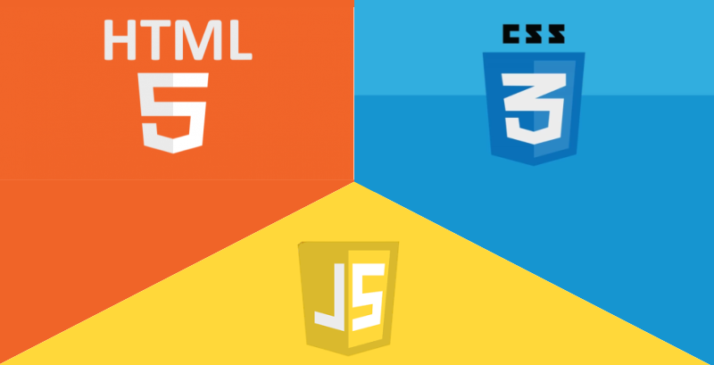

# Landing Page Iphone 13

This is the development of Landing page Iphone-13.

## 🔨 Project features

This was a development of a landing page with changing images through JavaScript, based on DOM events. I highly recommend this project for beginners developers, as it works well with html and css.

The landing page is designed to provide relevant and straightforward information about what the visitor is looking for and encourage them to take a specific action, such as filling out a form, making a purchase or subscribing to a mailing list. It can be used in online advertising campaigns, such as ads on Google or social media, or in other digital marketing strategies.

The [Tutorial of this application you can find here](https://www.youtube.com/watch?v=E3sKnfq4myo&ab_channel=MatheusBattisti-HoradeCodar).

## ✔️ Techniques and technologies used

Check out this list of everything we will use in this app:

- `JavaScript`
- `Semantic HTML`
- `HTML 5`
- `CSS 3`
- `GitHub`

## 🛠️ Open and run the project

To open and run the project, add the Live Server extension, click on the Go Live button usually located in the lower right corner if you are using vscode.

Then go to <a href="http://127.0.0.1:5500/">http://127.0.0.1:5500/</a> in your browser.

## 📚 More tutorial information

This landing page was developed from the tutorial [Matheus Battisti](https://www.youtube.com/@MatheusBattisti), Hora de Codar instructor. The main idea behind the implementation of this tutorial is to further evolve pure knowledge in html and css bases. When developing landing pages I learn about different effects, ux writing, and attractive color patterns.
